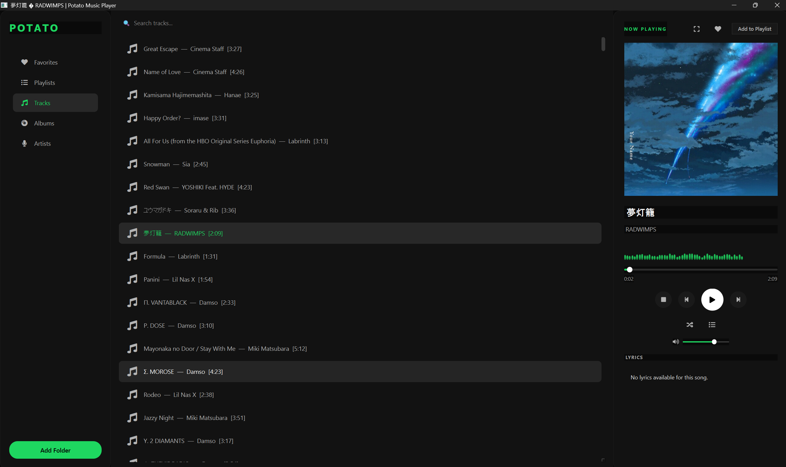

# Potato Music Player
dumb name but i love it somehow

feature-rich desktop music player built with PyQt6. Play local music files with a beautiful interface, album art, lyrics, visualizer, and playback controls.

##  Features

-  **Play all formats**: MP3, FLAC, WAV, OGG, M4A
-  **Album art display** with HQ badge for lossless files
-  **Lyrics viewer** with automatic extraction
-  **Spectrum visualizer** with smooth animations
-  **Playback modes**: Order, Loop All, Loop One, Shuffle
-  **Favorites system** with heart button
-  **Playlist management** with drag & drop
-  **Fullscreen mode** with immersive controls
-  **Global hotkeys**: Ctrl+Space, Ctrl+Left/Right, Ctrl+Up/Down, F11
-  **Modern dark theme** inspired by Spotify
-  **Drag & drop** folders and files
-  **Persistent settings** and library cache

## Screenshots

*Main player with Now Playing tab*

## Installation
download and extract then run .exe file

## note
still buggy and unfinish feature 
